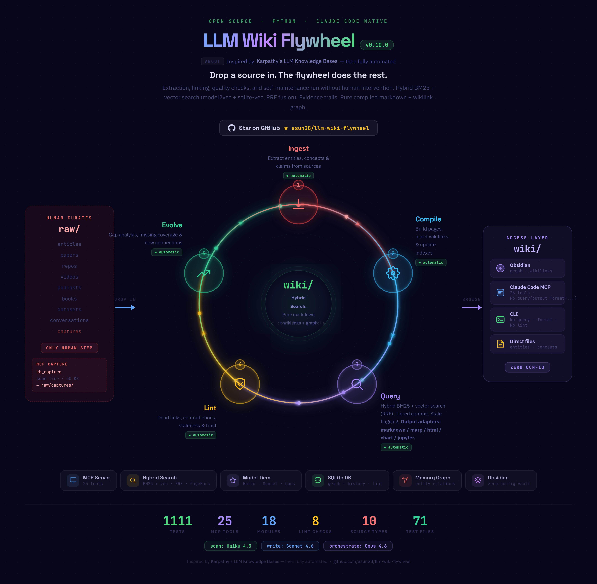

# LLM Knowledge Base

[](https://www.python.org/downloads/)
[](LICENSE)
[](#development)
[](#claude-code-integration-mcp-server)
[](CHANGELOG.md)

> **Compile, don't retrieve.** Drop a source in. Everything else is automatic — Claude extracts entities, builds interlinked wiki pages, injects wikilinks into existing pages, tracks trust scores, detects contradictions, and self-maintains. No vectors. No embeddings. No chunking. Just clean markdown you can browse in Obsidian.

Inspired by [Karpathy's LLM Knowledge Bases](https://gist.github.com/karpathy/442a6bf555914893e9891c11519de94f) — then **fully automated**.

## Why Not RAG?

RAG retrieves chunks. This system **understands structure**.

| | RAG | This Project |
|---|---|---|
| Storage | Vector embeddings you can't read | Markdown pages you can browse in Obsidian |
| Knowledge | Chunks with no relationships | Entities, concepts, and wikilinks forming a graph |
| Quality | Hope the top-K chunks are relevant | BM25 + PageRank ranking with trust scores |
| Maintenance | Re-embed when sources change | Incremental compile — only changed sources reprocessed |
| Contradictions | Silently returns conflicting chunks | Lint detects contradictions across sources |
| Gaps | No way to know what's missing | Evolve analyzes coverage gaps and suggests new pages |

## What Makes This Different from [Karpathy's Gist](https://gist.github.com/karpathy/442a6bf555914893e9891c11519de94f)?

Karpathy described a pattern where you manually ask an LLM to compile pages. This is a **fully automated system** — drop a file in `raw/`, run `kb compile`, and the entire pipeline runs without human intervention: extraction, page creation, cross-linking, index updates, and quality checks. Add Claude Code and you don't even need the CLI — just say "ingest this."

```
                    ┌──────────────────────────────────────┐
                    │           The Full Cycle              │
                    │                                      │
    raw/            │   Ingest ──→ Compile ──→ Query       │        Obsidian
  articles/   ────→ │     │                      │         │ ────→  Graph View
  papers/           │     │    Evolve ←── Lint   │         │        Browse
  videos/           │     │      │          │    │         │        Search
  repos/            │     └──────┘←─────────┘←───┘         │
                    │        continuous feedback loop       │
                    └──────────────────────────────────────┘
```

| Karpathy's pattern (manual) | This project (fully automated) |
|---|---|
| Manually ask LLM to write pages | **One command** → extraction, page creation, linking, indexing all automatic |
| Flat list of pages | **Knowledge graph** with PageRank centrality and Mermaid export |
| No change detection | **Incremental compile** — SHA-256 hashes detect changes, only reprocesses what's new |
| No cross-linking | **Retroactive wikilink injection** — new topics auto-linked into existing pages |
| No quality checks | **Self-healing** — lint catches problems, trust scoring flags bad pages, contradiction detection |
| No gap awareness | **Evolve** — automatically identifies missing coverage and connection opportunities |
| External LLM calls | **MCP-native** — 26 tools inside Claude Code, no API key needed |
| Text-only | **Obsidian** — open `wiki/` as a vault, visual knowledge graph for free |

## The 30-Second Demo

```bash
# 1. Grab an article
trafilatura -u https://example.com/ai-article > raw/articles/ai-article.md

# 2. Ingest it — Claude extracts entities, concepts, key claims
kb ingest raw/articles/ai-article.md

# 3. Watch the wiki grow
#    wiki/summaries/ai-article.md        ← source summary
#    wiki/entities/openai.md             ← auto-created entity page
#    wiki/concepts/attention.md          ← auto-created concept page
#    + wikilinks injected into existing pages that mention these topics

# 4. Query across all your sources
kb query "How does attention relate to transformers?"
#    → synthesized answer with [source: page_id] citations

# 5. Check wiki health
kb lint     # dead links, orphan pages, stale content, contradictions
kb evolve   # what topics are missing? what should be connected?
```

Or just talk to Claude Code:

> "Ingest this article into my wiki"
> "What does my wiki say about transformers?"
> "Show me the knowledge graph"

## Architecture



[Detailed architecture diagram](docs/architecture/architecture-diagram-detailed.html)

**Human curates sources. Everything else is automated** — extraction, compilation, cross-linking, querying, health checks, and gap analysis all run without human intervention.

| Layer | Path | Owner | Purpose |
|-------|------|-------|---------|
| **Raw** | `raw/` | Human | Immutable source documents (articles, papers, videos, repos, etc.) |
| **Wiki** | `wiki/` | LLM | Generated and maintained markdown pages with YAML frontmatter |
| **Research** | `research/` | Human | Analysis, project ideas, meta-research |

## Quick Start

```bash
git clone https://github.com/Asun28/llm-wiki-flywheel.git
cd llm-wiki-flywheel

python -m venv .venv
.venv\Scripts\activate        # Windows
source .venv/bin/activate     # Unix

pip install -r requirements.txt && pip install -e .
kb --version
```

**API key:** Copy `.env.example` to `.env` and add `ANTHROPIC_API_KEY` — or skip this entirely if you're using Claude Code Max (MCP tools use Claude Code as the LLM by default).

**Obsidian:** Open `wiki/` as a vault. Press `Ctrl+G` for the knowledge graph. See the **[full Obsidian guide](docs/guides/quickstart-obsidian.md)** ([HTML version](docs/guides/quickstart-obsidian.html)).

**New here?** Browse the [`demo/`](demo/) folder — a small working wiki compiled from Karpathy's [X post](https://x.com/karpathy/status/2039805659525644595) and [LLM-wiki gist](https://gist.github.com/karpathy/442a6bf555914893e9891c11519de94f). It shows the full folder structure plus a real compiled output — summaries, entities, concepts, a comparison, and a cross-source synthesis — so you can see exactly what the pipeline produces before adding your own sources.

## Five Operations

| Operation | Command | What happens |
|-----------|---------|-------------|
| **Ingest** | `kb ingest <file>` | Extract entities, concepts, key claims → create wiki pages → inject wikilinks → update indexes |
| **Compile** | `kb compile` | Batch-ingest all new/changed sources (SHA-256 hash detection, crash-safe) |
| **Query** | `kb query "..."` | BM25 + PageRank search → synthesize answer with inline citations |
| **Lint** | `kb lint` | Dead links, orphan pages, staleness, stubs, frontmatter, source coverage, wikilink cycles, low-trust pages |
| **Evolve** | `kb evolve` | Coverage gaps, connection opportunities, missing page types, disconnected components |

## Key Features

### Ingest Pipeline
- 10 source types: article, paper, video, repo, podcast, book, dataset, conversation, comparison, synthesis
- Hash-based dedup — same content won't be ingested twice
- **Retroactive wikilink injection** — when you ingest a new topic, existing pages that mention it get auto-linked
- Cascade tracking — returns which existing pages might need review after the new ingest
- Short-source tiering — small sources (<1000 chars) defer entity creation to prevent stubs
- **Conversation capture** — `kb_capture` MCP tool atomizes chat / notes / session transcripts into typed knowledge items (decisions, discoveries, corrections, gotchas) with secret-scanner safety rails and a per-process rate limit

### Search & Query
- **BM25 ranking** with title boosting and document length normalization
- **PageRank blending** — well-connected pages rank higher
- Context truncated to 80K chars with intelligent page selection
- Inline citations: `[source: concepts/attention]` traces every claim

### Quality System
- **Bayesian trust scoring** — query feedback builds per-page trust. "Wrong" penalized 2x vs "incomplete"
- **Semantic lint** — deep fidelity checks (page vs source) and cross-page contradiction detection
- **Actor-Critic review** — structured 6-item review checklist with audit trail
- **Verdict trends** — weekly pass/fail/warning dashboard showing quality trajectory

### Knowledge Graph
- NetworkX-powered graph from wikilinks
- PageRank and betweenness centrality
- Mermaid diagram export (auto-prunes for large graphs)
- **Obsidian-compatible** — native graph view from `wiki/` vault

### Claude Code Integration (MCP Server)

26 tools that work natively in Claude Code. **No API key needed** — Claude Code is the default LLM.

```json
{
  "mcpServers": {
    "kb": {
      "command": ".venv/Scripts/python.exe",
      "args": ["-m", "kb.mcp_server"]
    }
  }
}
```

**Talk naturally:**

| What you want | What to say |
|---------------|------------|
| Ingest a file | "Ingest raw/articles/file.md into the wiki" |
| Ingest a URL | "Save this URL to my knowledge base: ..." |
| Ask a question | "What does my wiki say about transformers?" |
| Check health | "Run lint on my wiki" |
| Find gaps | "What topics are missing from my wiki?" |
| See the graph | "Show me the knowledge graph" |

<details>
<summary><b>All 26 MCP tools</b></summary>

#### Core

| Tool | Description |
|------|-------------|
| `kb_query` | Query the wiki. Returns context for Claude Code to answer. Add `use_api=true` for API synthesis. |
| `kb_ingest` | Ingest a source file. Pass `extraction_json` with your extraction; omit it to get the prompt first. |
| `kb_ingest_content` | One-shot: provide raw content + extraction JSON; saves to `raw/` and creates all wiki pages. |
| `kb_save_source` | Save content to `raw/` without ingesting. Errors if file exists unless `overwrite=true`. |
| `kb_capture` | Atomize up to 50KB of chat/notes/transcripts into typed `raw/captures/*.md` items via scan-tier LLM. Secret-scanner rejects API keys/tokens before any LLM call. |
| `kb_compile_scan` | List new/changed sources that need `kb_ingest`. |

#### Browse & Health

| Tool | Description |
|------|-------------|
| `kb_search` | BM25 + PageRank keyword search across wiki pages |
| `kb_read_page` | Read a specific wiki page by ID |
| `kb_list_pages` | List all pages, optionally filtered by type |
| `kb_list_sources` | List all raw source files |
| `kb_stats` | Page counts, graph metrics, coverage info |
| `kb_lint` | Health checks with auto-fix support |
| `kb_evolve` | Gap analysis and connection suggestions |
| `kb_detect_drift` | Find wiki pages stale due to raw source changes |
| `kb_compile` | Compile wiki from raw sources |
| `kb_graph_viz` | Export knowledge graph as Mermaid diagram |
| `kb_verdict_trends` | Weekly quality trends from verdict history |

#### Quality

| Tool | Description |
|------|-------------|
| `kb_review_page` | Page + sources + checklist for quality review |
| `kb_refine_page` | Update page preserving frontmatter, with audit trail |
| `kb_lint_deep` | Source fidelity check (page vs raw source) |
| `kb_lint_consistency` | Cross-page contradiction check |
| `kb_query_feedback` | Record query success/failure for trust scoring |
| `kb_reliability_map` | Page trust scores from feedback history |
| `kb_affected_pages` | Pages affected by a change (backlinks + shared sources) |
| `kb_save_lint_verdict` | Record lint/review verdict for audit trail |
| `kb_create_page` | Create comparison/synthesis/any wiki page directly |

</details>

## Model Tiering

Three Claude tiers balance cost and quality. Override via environment variables:

| Tier | Model | Override | Used For |
|------|-------|---------|----------|
| `scan` | Haiku 4.5 | `CLAUDE_SCAN_MODEL` | Index reads, link checks, diffs |
| `write` | Sonnet 4.6 | `CLAUDE_WRITE_MODEL` | Extraction, summaries, page writing |
| `orchestrate` | Opus 4.6 | `CLAUDE_ORCHESTRATE_MODEL` | Query synthesis, orchestration |

## Supported Sources

| Type | Capture Method |
|------|----------------|
| Article | `trafilatura -u URL` or `crwl URL -o markdown` |
| Paper | `markitdown file.pdf` or `docling file.pdf` |
| Video | `yt-dlp --write-auto-sub --skip-download URL` |
| Repo | Manual markdown summary |
| Podcast | Transcript markdown |
| Book | Manual notes or `markitdown` |
| Dataset | Schema documentation |
| Conversation | Chat/interview transcript |

<details>
<summary><b>Project structure</b></summary>

```
llm-wiki-flywheel/
  raw/                     # Immutable source documents
    articles/papers/repos/videos/podcasts/books/datasets/conversations/assets/
  wiki/                    # LLM-generated wiki pages
    entities/concepts/comparisons/summaries/synthesis/
    index.md  _sources.md  _categories.md  log.md  contradictions.md
  templates/               # 10 YAML extraction schemas
  src/kb/                  # Python package (~6,200 lines)
    cli.py                 # Click CLI (6 commands)
    config.py              # Paths, model tiers, tuning constants
    mcp/                   # FastMCP server (25 tools)
    models/                # WikiPage, RawSource, frontmatter validation
    ingest/                # Pipeline + template-driven extractors
    compile/               # Incremental compiler + wikilink linker
    query/                 # BM25 + PageRank search + citations
    lint/                  # 8 checks + semantic lint + verdict trends
    evolve/                # Coverage analysis + connection discovery
    graph/                 # NetworkX graph + stats + Mermaid export
    feedback/              # Bayesian trust scoring
    review/                # Page-source pairing + refiner
    utils/                 # Hashing, LLM calls, text, I/O
  tests/                   # 1434 tests across 101 files
```

</details>

<details>
<summary><b>Development</b></summary>

```bash
.venv\Scripts\activate          # Windows
source .venv/bin/activate       # Unix

pip install -r requirements.txt && pip install -e .
python -m pytest                # 1177 tests
ruff check src/ tests/ --fix    # Lint
ruff format src/ tests/         # Format
```

Python 3.12+. Ruff (line length 100, rules E/F/I/W/UP).

</details>

## Roadmap

- **Phase 4 (v0.10.0 shipped 2026-04-12):** Hybrid search with RRF fusion, 4-layer search dedup pipeline, evidence trail sections, stale truth flagging at query time, layered context assembly, raw-source fallback retrieval, auto-contradiction detection on ingest, multi-turn query rewriting. Post-release audit (unreleased) resolved all HIGH (23) + MEDIUM (~30) + LOW (~30) items.
- **Phase 4.11 (unreleased, 2026-04-14):** `kb_query --format={markdown|marp|html|chart|jupyter}` output adapters — synthesized answers saved as Markdown docs, Marp slide decks, self-contained HTML pages, matplotlib Python scripts (+ JSON data sidecar), or executable Jupyter notebooks. Files land at `outputs/{ts}-{slug}.{ext}` (gitignored) with provenance frontmatter. Addresses Karpathy Tier 1 #1.
- **Phase 5 (deferred):** Inline claim-level confidence tags + EXTRACTED lint verification, URL-aware `kb_ingest` with 5-state adapter model, page status lifecycle (seed→developing→mature→evergreen), inline quality callout markers, autonomous research loop in evolve, conversation capture `kb_capture` MCP tool, chunk-level BM25 sub-page indexing, typed semantic relations on graph edges, interactive graph HTML viewer (vis.js), semantic edge inference (LLM-inferred implicit relationships), living overview page, actionable gap-fill source suggestions, two-phase compile pipeline, multi-hop retrieval, conversation→KB promotion, temporal claim tracking, BM25 + LLM reranking
- **Phase 6 (future):** DSPy optimization, RAGAS evaluation, Monte Carlo evidence sampling

<details>
<summary><b>Completed phases</b></summary>

- **v0.3.0:** 5 operations + graph + CLI + MCP server (12 tools)
- **v0.4.0:** Quality system — Bayesian trust, Actor-Critic review, semantic lint
- **v0.5.0:** Robustness — YAML injection protection, path canonicalization
- **v0.6.0:** DRY refactor — shared utilities, test fixtures. 180 tests
- **v0.7.0:** MCP server split, PageRank, entity enrichment, persistent verdicts. 234 tests
- **v0.8.0:** BM25 search engine. 252 tests
- **v0.9.0–v0.9.9:** Hardening, comprehensive audit, structured outputs, content growth. 564 tests
- **v0.9.10–v0.9.13:** Citation fixes, compile scan, BM25 dedup, 54-item backlog fix. 651 tests
- **v0.9.14:** Phase 3.95 — 38-item backlog remediation. 692 tests
- **v0.9.15:** Phase 3.96 — 153 fixes (4 CRITICAL, 31 HIGH, 54 MEDIUM, 64 LOW). 952 tests
- **v0.9.16:** Phase 3.97 — 62 fixes: atomic writes, MCP exception guards, slugify symbol mapping, CRLF fix, integer title coercion, contradiction detection improvements. 1033 tests
- **v0.10.0:** Phase 4 — hybrid search with RRF fusion (BM25 + vector via model2vec + sqlite-vec), 4-layer search dedup pipeline, evidence trail sections, stale truth flagging at query time, layered context assembly, raw-source fallback retrieval, auto-contradiction detection on ingest, multi-turn query rewriting. Post-release audit resolved all HIGH (23) + MEDIUM (~30) + LOW (~30) items. 1177 tests across 55 files

</details>

## Special Thanks

| Project | What we learned |
|---------|----------------|
| [Karpathy's LLM Knowledge Bases](https://gist.github.com/karpathy/442a6bf555914893e9891c11519de94f) | The original "compile, don't retrieve" pattern |
| [DocMason](https://github.com/JetXu-LLM/DocMason) | Validation gate, retrieve/trace loop, answer trace enforcement |
| [Graphify](https://github.com/safishamsi/graphify) | Community detection, per-claim confidence markers |
| [Sirchmunk](https://github.com/modelscope/sirchmunk) | Monte Carlo sampling, multi-turn query rewriting |
| [MemPalace](https://github.com/milla-jovovich/mempalace) | Layered context stack, temporal knowledge graph |
| [Microsoft GraphRAG](https://github.com/microsoft/graphrag) | Graph-based retrieval augmented generation |

<details>
<summary><b>More inspirations</b></summary>

| Project | What we learned |
|---------|----------------|
| [llm-wiki-compiler](https://github.com/ussumant/llm-wiki-compiler) | Two-phase compile pipeline |
| [rvk7895/llm-knowledge-bases](https://github.com/rvk7895/llm-knowledge-bases) | Claude Code plugin for Obsidian |
| [Ars Contexta](https://github.com/agenticnotetaking/arscontexta) | Knowledge system generation through conversation |
| [Remember.md](https://github.com/remember-md/remember) | Session knowledge extraction |
| [kepano/obsidian-skills](https://github.com/kepano/obsidian-skills) | Agent skills for Obsidian vaults |
| [lean-ctx](https://github.com/yvgude/lean-ctx) | Hybrid context optimization |
| [DSPy optimization patterns](https://github.com/KazKozDev/dspy-optimization-patterns) | Teacher-Student prompt tuning |
| [awesome-llm-knowledge-bases](https://github.com/SingggggYee/awesome-llm-knowledge-bases) | Curated tool list |
| [qmd](https://github.com/tobi/qmd) | Markdown-native querying |
| [Quartz](https://github.com/jackyzha0/quartz) | Static site generation from wiki |
| [claude-obsidian](https://github.com/AgriciDaniel/claude-obsidian) | Hot cache pattern, page status lifecycle, inline quality callouts, autonomous research loop |
| [llm-wiki-skill](https://github.com/sdyckjq-lab/llm-wiki-skill) | Inline claim-level confidence annotation, 5-state adapter model for URL-aware ingest |

</details>

## Contributing

This project is actively developed and ideas/issues are welcome.

- **Found a bug?** Open an issue on [GitHub](https://github.com/Asun28/llm-wiki-flywheel/issues)
- **Have an idea?** Check the [Roadmap](#roadmap) first — if it's not there, open an issue to discuss
- **Want to follow along?** Star the repo and watch for releases — each phase ships meaningful new features

The codebase is intentionally readable: no magic frameworks, just Python + BM25 + NetworkX + FastMCP. If you've built knowledge systems, RAG pipelines, or LLM tooling before, the code should be familiar territory within 30 minutes.

> **Not accepting PRs yet** — the architecture is still evolving quickly and merging external changes is expensive. Issues, feedback, and ideas are the best way to contribute right now.

## License

[MIT License](LICENSE)
