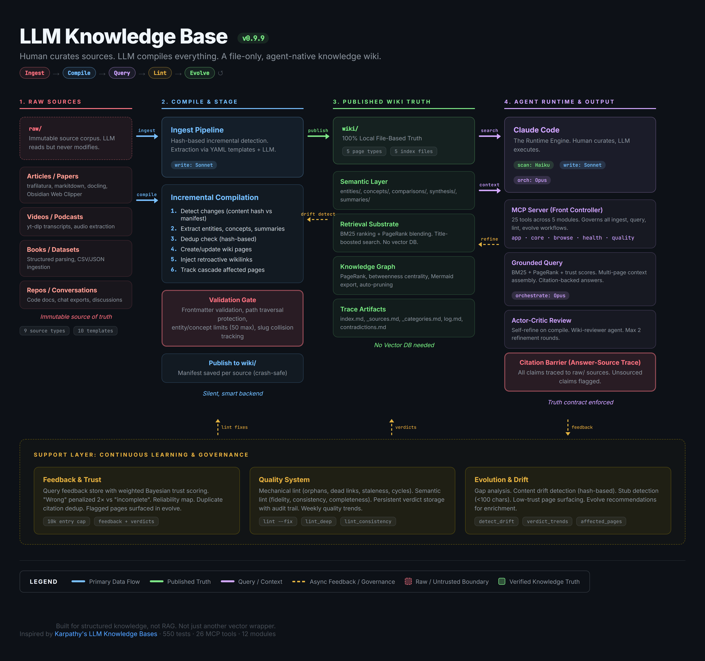

# LLM Knowledge Base

A personal, LLM-maintained knowledge wiki that **compiles** raw sources into structured, interlinked markdown — no RAG, no vector databases, just clean wiki pages built and maintained by Claude.

Inspired by [Karpathy's LLM Knowledge Bases pattern](https://gist.github.com/karpathy/442a6bf555914893e9891c11519de94f).

## Architecture



## How It Works

```
raw/                    wiki/                         
  articles/               entities/                   
  papers/      Ingest      concepts/      Query       
  videos/    ---------> comparisons/ ----------> Answers
  repos/       Compile    summaries/     with citations
  books/                  synthesis/                   
  ...                     index.md                    
                          log.md                      
                                                      
              Lint -----> Health report               
              Evolve ---> Gap analysis                
```

**Human curates sources. LLM handles everything else** — extraction, compilation, linking, querying, maintenance, and gap analysis.

### Three-Layer Content Structure

| Layer | Path | Owner | Purpose |
|-------|------|-------|---------|
| **Raw** | `raw/` | Human | Immutable source documents (articles, papers, videos, repos, etc.) |
| **Wiki** | `wiki/` | LLM | Generated and maintained markdown pages with YAML frontmatter |
| **Research** | `research/` | Human | Analysis, project ideas, meta-research |

### Five Operations Cycle

| Operation | What it does |
|-----------|-------------|
| **Ingest** | Read a raw source, extract structured data via LLM, generate summary + entity + concept pages, update indexes |
| **Compile** | Scan all raw sources, detect changes via content hashes, batch-ingest new/modified sources |
| **Query** | Search wiki pages using BM25 ranking, synthesize answers with inline citations using Claude |
| **Lint** | Health checks: dead links, orphan pages, staleness, frontmatter validation, source coverage, wikilink cycles |
| **Evolve** | Gap analysis: under-linked concepts, missing page types, connection opportunities, new page suggestions |

## Quick Start

```bash
# Clone and set up
git clone https://github.com/Asun28/LLM-Knowledge-Base.git
cd LLM-Knowledge-Base

# Create virtual environment
python -m venv .venv
.venv\Scripts\activate        # Windows
source .venv/bin/activate     # Unix

# Install dependencies
pip install -r requirements.txt
pip install -e .

# Configure API key (optional — not needed with Claude Code Max)
cp .env.example .env
# Edit .env and add your ANTHROPIC_API_KEY (only for kb ingest / kb query CLI commands)

# Verify installation
kb --version
```

## Usage

### Ingest a Source

Drop a markdown file into `raw/` and ingest it:

```bash
# Web article to markdown (pick one)
trafilatura -u https://example.com/article > raw/articles/article-name.md
crwl https://example.com/article -o markdown > raw/articles/article-name.md

# Ingest into the wiki
kb ingest raw/articles/article-name.md --type article
```

The ingest pipeline:
1. Reads the raw source and checks for **duplicate content** (hash-based dedup against manifest)
2. Calls Claude (Sonnet) to extract title, key claims, entities, concepts
3. Creates `wiki/summaries/article-name.md`
4. Creates/updates entity pages in `wiki/entities/` (with context from extraction data)
5. Creates/updates concept pages in `wiki/concepts/` (with context from extraction data)
6. **Injects retroactive wikilinks** into existing pages that mention newly created page titles
7. Updates `wiki/index.md`, `wiki/_sources.md`, `wiki/log.md`
8. Returns **affected pages** (backlinks + shared sources) for cascade review
9. Detects and warns on slug collisions (e.g., "GPT 4" and "GPT-4" both → `gpt-4`)
10. **Short sources** (<1000 chars) can defer entity/concept creation to prevent stub proliferation

Source type is auto-detected from the `raw/` subdirectory, or specify with `--type`:
`article`, `paper`, `repo`, `video`, `podcast`, `book`, `dataset`, `conversation`

### Compile (Batch Ingest)

Process all new and changed sources at once:

```bash
kb compile              # Incremental (only new/changed sources)
kb compile --full       # Full recompile
```

Uses SHA-256 content hashes stored in `.data/hashes.json` to detect changes. Manifest is saved after each successful source ingest (crash-safe).

### Query

Ask questions and get answers with citations:

```bash
kb query "What is compile-not-retrieve?"
```

Searches wiki pages using BM25 ranking blended with PageRank (well-linked pages rank higher), builds context (truncated to 80K chars), and calls Claude (Opus) to synthesize an answer with `[source: page_id]` citations.

### Lint

Run health checks:

```bash
kb lint              # Report issues
kb lint --fix        # Auto-fix dead links (replaces broken [[links]] with plain text)
```

Checks for:
- Dead wikilinks (broken `[[references]]`) — auto-fixable with `--fix`
- Orphan pages (no incoming links)
- Stale pages (not updated in 90+ days)
- Stub pages (body content under 100 chars)
- Invalid frontmatter (missing required fields)
- Uncovered raw sources (not referenced by any wiki page)
- Wikilink cycles (A → B → C → A)
- Low-trust pages flagged by query feedback

### Evolve

Analyze gaps and get improvement suggestions:

```bash
kb evolve
```

Reports:
- Coverage by page type (entities, concepts, comparisons, summaries, synthesis)
- Orphan concepts with no backlinks
- Unlinked pages that share terms (connection opportunities)
- Dead links that suggest new pages to create
- Disconnected graph components
- Coverage gaps from query feedback

### Claude Code Integration (MCP Server)

The knowledge base ships with a built-in [MCP server](https://modelcontextprotocol.io/) with **25 tools**. **Claude Code is the default LLM** — no API key needed. `kb_query` and `kb_ingest` use Claude Code for all intelligence; add `use_api=true` to call the Anthropic API instead.

```bash
# Start the MCP server standalone
kb mcp

# Or run as a Python module
python -m kb.mcp_server
```

**Setup:** Add to your `.mcp.json` (already configured in this repo):

```json
{
  "mcpServers": {
    "kb": {
      "command": ".venv/Scripts/python.exe",
      "args": ["-m", "kb.mcp_server"]
    }
  }
}
```

After restarting Claude Code, you get 25 tools:

#### Core Tools (Claude Code is the default LLM)

| Tool | Description |
|------|-------------|
| `kb_query` | Query the wiki. Returns context for Claude Code to answer. Add `use_api=true` for API synthesis. |
| `kb_ingest` | Ingest a source file. Pass `extraction_json` with your extraction; omit it to get the prompt first. Add `use_api=true` for API extraction. |
| `kb_ingest_content` | **One-shot**: provide raw content + extraction JSON; saves to `raw/` and creates all wiki pages. |
| `kb_save_source` | Save content to `raw/` without ingesting (ingest later with `kb_ingest`). |
| `kb_compile_scan` | List new/changed sources that need `kb_ingest`. |

#### Browse & Health Tools (always local)

| Tool | Description |
|------|-------------|
| `kb_search` | Keyword search across wiki pages (BM25 + PageRank blending) |
| `kb_read_page` | Read a specific wiki page by ID |
| `kb_list_pages` | List all pages, optionally filtered by type |
| `kb_list_sources` | List all raw source files |
| `kb_stats` | Page counts, graph metrics, coverage info |
| `kb_lint` | Health checks (dead links, orphans, staleness, stubs, low-trust pages) |
| `kb_evolve` | Gap analysis and connection suggestions |
| `kb_detect_drift` | Find wiki pages stale due to raw source changes |
| `kb_compile` | Compile wiki from raw sources (incremental or full) |
| `kb_graph_viz` | Export knowledge graph as Mermaid diagram (auto-prunes large graphs) |
| `kb_verdict_trends` | Show weekly quality trends from verdict history |

#### Quality Tools (Phase 2)

| Tool | Description |
|------|-------------|
| `kb_review_page` | Page + sources + checklist for quality review |
| `kb_refine_page` | Update page preserving frontmatter, with audit trail |
| `kb_lint_deep` | Source fidelity check (page vs raw source side-by-side) |
| `kb_lint_consistency` | Cross-page contradiction check |
| `kb_query_feedback` | Record query success/failure for trust scoring |
| `kb_reliability_map` | Page trust scores from feedback history |
| `kb_affected_pages` | Pages affected by a change (backlinks + shared sources) |
| `kb_save_lint_verdict` | Record lint/review verdict for persistent audit trail |
| `kb_create_page` | Create comparison/synthesis/any wiki page directly |

**Workflows:**

```
# Query (Claude Code answers directly)
kb_query("What is RAG?")  -> returns wiki context -> Claude Code synthesizes answer

# Ingest a file in raw/
kb_ingest("raw/articles/rag.md")                    -> returns extraction prompt
kb_ingest("raw/articles/rag.md", extraction_json=...) -> creates wiki pages

# Ingest a URL (one-shot)
1. Fetch content from URL
2. Extract title, entities, concepts
3. kb_ingest_content(content, "article-name", "article", extraction_json)

# Batch compile
kb_compile_scan()  -> lists sources -> kb_ingest each with extraction_json

# Quality review (Phase 2)
kb_review_page("concepts/rag")  -> review context -> kb_refine_page if issues
kb_lint_deep("concepts/rag")    -> fidelity check -> fix unsourced claims
kb_query_feedback(question, "useful", "concepts/rag")  -> builds trust scores

# Create comparison/synthesis pages
kb_create_page("comparisons/rag-vs-finetuning", "RAG vs Fine-tuning", content)

# Record lint verdicts for audit trail
kb_save_lint_verdict("concepts/rag", "fidelity", "pass", notes="All claims traced")

# Visualize and monitor
kb_graph_viz(max_nodes=30)          -> Mermaid diagram of knowledge graph
kb_verdict_trends()                 -> weekly quality improvement dashboard
kb_detect_drift()                   -> find wiki pages stale due to source changes
```

**Example prompts in Claude Code:**
> "Search my knowledge base for RAG" -> `kb_search`
> "What does my wiki say about transformers?" -> `kb_query`
> "Ingest this article into my wiki" -> `kb_ingest` or `kb_ingest_content`
> "Show me wiki health" -> `kb_lint`
> "What sources need processing?" -> `kb_compile_scan`
> "Review this wiki page for accuracy" -> `kb_review_page`
> "Show me the knowledge graph" -> `kb_graph_viz`
> "How is wiki quality trending?" -> `kb_verdict_trends`

## Supported Source Types

| Type | Template | Capture Method |
|------|----------|----------------|
| Article | `templates/article.yaml` | `trafilatura -u URL` or `crwl URL -o markdown` |
| Paper | `templates/paper.yaml` | `markitdown file.pdf` or `docling file.pdf` |
| Video | `templates/video.yaml` | `yt-dlp --write-auto-sub --skip-download URL` |
| Repo | `templates/repo.yaml` | Manual markdown summary |
| Podcast | `templates/podcast.yaml` | Transcript markdown |
| Book | `templates/book.yaml` | Manual notes or `markitdown` |
| Dataset | `templates/dataset.yaml` | Schema documentation |
| Conversation | `templates/conversation.yaml` | Chat/interview transcript |
| Comparison | `templates/comparison.yaml` | Created via `kb_create_page` (multi-source) |
| Synthesis | `templates/synthesis.yaml` | Created via `kb_create_page` (cross-source) |

Each template defines extraction fields and wiki output mappings. The LLM uses these to consistently extract structured data from any source type. Source types are validated against this whitelist before processing.

## Wiki Page Format

Every wiki page uses YAML frontmatter for metadata:

```yaml
---
title: Retrieval Augmented Generation
source:
  - raw/articles/rag-overview.md
created: 2026-04-06
updated: 2026-04-06
type: concept
confidence: stated
---

# Retrieval Augmented Generation

RAG combines retrieval with generation...

## Key Claims

- Claim 1
- Claim 2

## Entities Mentioned

- [[entities/openai|OpenAI]]

## Concepts

- [[concepts/vector-search|Vector Search]]
```

**Page types:** `entity`, `concept`, `comparison`, `summary`, `synthesis`

**Confidence levels:** `stated` (directly from source), `inferred` (derived from multiple sources), `speculative` (LLM reasoning)

## Quality System (Phase 2)

The knowledge base includes a multi-layer quality system:

**Trust scoring** — Bayesian page trust based on query feedback. "Wrong" answers penalized 2x vs "incomplete". Pages below the trust threshold are automatically flagged during lint.

**Review workflow** — `kb_review_page` pairs wiki pages with their raw sources and a 6-item checklist (source fidelity, entity accuracy, wikilink validity, confidence match, no hallucination, title accuracy). Claude Code or a wiki-reviewer sub-agent evaluates and produces structured JSON reviews. Issues are fixed via `kb_refine_page` (max 2 rounds). Review history tracks content length and status for auditability.

**Semantic lint** — Deep fidelity checks (`kb_lint_deep`) compare page claims against source content. Consistency checks (`kb_lint_consistency`) group related pages by shared sources, wikilinks, and significant term overlap (with frontmatter stripping and common-word filtering) to detect contradictions.

**Affected page tracking** — After updating a page, `kb_affected_pages` identifies backlinks and shared-source pages that may need review. The ingest pipeline now returns `affected_pages` automatically for cascade review.

**Verdict trends** — `kb_verdict_trends` analyzes verdict history to show weekly pass/fail/warning rates and whether quality is improving, stable, or declining.

**Graph visualization** — `kb_graph_viz` exports the knowledge graph as a Mermaid diagram, auto-pruning to the most-connected nodes for large graphs. Compatible with Obsidian, GitHub, and VS Code.

**LLM resilience** — All API calls retry up to 3 times with exponential backoff on rate limits, overload, connection errors, and timeouts. Non-retryable errors (401/403) raise immediately with descriptive `LLMError`.

## Model Tiering

The system uses three Claude model tiers to balance cost and quality. Override via environment variables:

| Tier | Model | Env Override | Used For |
|------|-------|-------------|----------|
| `scan` | Claude Haiku 4.5 | `CLAUDE_SCAN_MODEL` | Index reads, link checks, file diffs |
| `write` | Claude Sonnet 4.6 | `CLAUDE_WRITE_MODEL` | Article writing, extraction, summaries |
| `orchestrate` | Claude Opus 4.6 | `CLAUDE_ORCHESTRATE_MODEL` | Query answering, orchestration, verification |

## Project Structure

```
LLM-Knowledge-Base/
  raw/                     # Immutable source documents
    articles/papers/repos/videos/podcasts/books/datasets/conversations/assets/
  wiki/                    # LLM-generated wiki pages
    entities/concepts/comparisons/summaries/synthesis/
    index.md               # Master catalog
    _sources.md            # Source traceability
    _categories.md         # Category tree
    log.md                 # Activity log
    contradictions.md      # Conflict tracker
  research/                # Human-authored analysis
  templates/               # 10 YAML extraction schemas
  src/kb/                  # Python package (~4,100 lines)
    cli.py                 # Click CLI (6 commands)
    config.py              # Paths, model tiers, tuning constants
    mcp_server.py          # MCP entry point (thin wrapper)
    mcp/                   # FastMCP server package (25 tools: core, browse, health, quality)
    models/                # WikiPage, RawSource, frontmatter validation
    ingest/                # Pipeline (dedup, cascade, tiering) + extractors (template-driven)
    compile/               # Hash-based incremental compiler (crash-safe) + linker (wikilink injection)
    query/                 # BM25 + PageRank blended search + context truncation + citations
    lint/                  # 8 mechanical checks + semantic context builders + verdict trends
    evolve/                # Coverage analysis + connection discovery
    graph/                 # NetworkX graph builder + stats + Mermaid export
    feedback/              # Bayesian trust scoring + reliability analysis
    review/                # Page-source pairing + frontmatter-preserving refiner
    utils/                 # Shared: hashing, markdown, LLM (retry/timeout), text, wiki_log, pages, io
  tests/                   # 564 tests across 38 test files (~35s)
```

## Development

```bash
# Activate venv (always use project .venv)
.venv\Scripts\activate        # Windows
source .venv/bin/activate     # Unix

# Install
pip install -r requirements.txt && pip install -e .

# Run tests
python -m pytest

# Lint & format
ruff check src/ tests/
ruff check src/ tests/ --fix
ruff format src/ tests/
```

Python 3.12+. Ruff for linting (line length 100, rules E/F/I/W/UP).

## Roadmap

- **Phase 1 (complete, v0.3.0):** 5 operations + graph + CLI + MCP server (12 tools), hash-based incremental compile, model tiering
- **Phase 2 (complete, v0.4.0):** Quality system — feedback loop with Bayesian trust scoring, Actor-Critic review workflow, semantic lint (fidelity + consistency), page refiner with audit trail. 7 new MCP tools, wiki-reviewer agent
- **Phase 2.1 (complete, v0.5.0):** Robustness — weighted trust formula, path canonicalization, YAML injection protection, extraction validation, config-driven tuning
- **Phase 2.2 (complete, v0.6.0):** DRY refactor — shared utilities eliminated all code duplication, source type validation, source field normalization, consolidated test fixtures. 180 tests
- **Phase 2.3 (complete, v0.7.0):** S+++ upgrade — MCP server split, graph PageRank/centrality, entity enrichment, persistent lint verdicts, case-insensitive wikilinks, template hash detection, comparison/synthesis templates, 2 new tools. 21 MCP tools, 234 tests
- **Phase 3.0 (complete, v0.8.0):** BM25 search engine — replaced bag-of-words with BM25 ranking. 252 tests
- **Phase 3.1 (complete, v0.9.0):** Hardening — path traversal, citation regex, MCP error handling, SDK fixes. 289 tests
- **Phase 3.2 (complete, v0.9.1):** Comprehensive audit — 93 new tests, MCP coverage 41%→95%. 382 tests
- **Phase 3.3 (complete, v0.9.2):** 15 bug fixes, input validation hardening. 414 tests
- **Phase 3.4 (complete, v0.9.3):** `kb_compile` + `kb lint --fix`. 431 tests
- **Phase 3.5–3.8 (complete, v0.9.4–v0.9.7):** Stub detection, drift detection, tier audits, observability. 490 tests
- **Phase 3.9a (complete, v0.9.8):** Structured outputs (`call_llm_json`), shared retry, atomic writes, extraction schema builder. 518 tests
- **Phase 3.9 (complete, v0.9.9):** Content growth infrastructure — env-configurable model tiers, PageRank-blended search, hash-based duplicate detection, verdict trend dashboard (`kb_verdict_trends`), Mermaid graph export (`kb_graph_viz`), retroactive wikilink injection (auto-triggered on ingest), content-length ingest tiering, cascade update detection (surfaced in `kb_ingest` MCP output). 3 new MCP tools (26 total), 46 new tests (564 total)
- **Phase 4 (200+ pages):** DSPy Teacher-Student optimization, RAGAS evaluation, Reweave, Pydantic extraction validation, arxiv MCP integration, semantic dependency tracking, URL-based smart routing. Research in `research/agent-architecture-research.md`

## Special Thanks

This project stands on the shoulders of these ideas, tools, and people:

### Origin

| Project | Author | Contribution |
|---------|--------|-------------|
| [LLM Knowledge Bases](https://gist.github.com/karpathy/442a6bf555914893e9891c11519de94f) | Andrej Karpathy | The original "compile, don't retrieve" pattern that started it all |

### Architecture Inspiration

| Project | What we learned |
|---------|----------------|
| [DocMason](https://github.com/JetXu-LLM/DocMason) | Architecture diagram style, pre-publish validation gate, iterative retrieve/trace loop, answer trace enforcement, structured knowledge index |
| [llm-wiki-compiler](https://github.com/ussumant/llm-wiki-compiler) | Two-phase compile pipeline (extract across all sources before writing) |
| [Graphify](https://github.com/safishamsi/graphify) | Leiden community detection, health report generation, surprise scoring, per-claim confidence markers, deterministic pre-extraction |
| [rvk7895/llm-knowledge-bases](https://github.com/rvk7895/llm-knowledge-bases) | Reference Claude Code plugin implementing compile/query/lint cycle for Obsidian |

### Knowledge System Patterns

| Project | What we learned |
|---------|----------------|
| [Ars Contexta](https://github.com/agenticnotetaking/arscontexta) | Individualized knowledge system generation through conversation |
| [Remember.md](https://github.com/remember-md/remember) | Session knowledge extraction, YAML frontmatter + wikilinks for Obsidian compatibility |
| [kepano/obsidian-skills](https://github.com/kepano/obsidian-skills) | Agent skills for working with Obsidian vaults |
| [lean-ctx](https://github.com/yvgude/lean-ctx) | Hybrid context optimization techniques for reducing token consumption |
| [DSPy optimization patterns](https://github.com/KazKozDev/dspy-optimization-patterns) | Teacher-Student optimization for prompt tuning |

### Ecosystem & Research

| Project | What we learned |
|---------|----------------|
| [awesome-llm-knowledge-bases](https://github.com/SingggggYee/awesome-llm-knowledge-bases) | Curated tool list for LLM-powered personal knowledge bases |
| [qmd](https://github.com/tobi/qmd) | Markdown-native querying patterns |
| [Quartz](https://github.com/jackyzha0/quartz) | Static site generation from wiki content |
| [Microsoft GraphRAG](https://github.com/microsoft/graphrag) | Graph-based retrieval augmented generation patterns |

## License

[MIT License](LICENSE)
